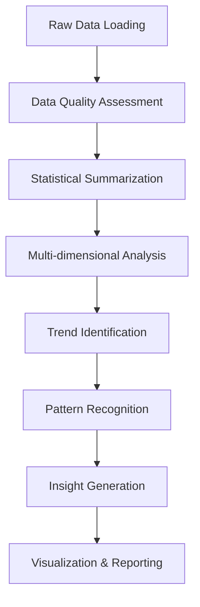

_____
# Project:  7.Real-time Vehicle Registration Data Analytics

## 📊 Project Overview
Comprehensive analysis of vehicle registration data across India, examining trends, patterns, and insights from 2007-08 to 2020-21.

## 🎯 Analysis Objectives


### Dataset Overview
- Analyze vehicle registration data with 1,000 records across 8 features
- Examine comprehensive dataset structure and characteristics

### Data Quality Assessment
- Perform missing value analysis and validation
- Conduct duplicate detection and removal
- Ensure data integrity and consistency

### Statistical Analysis
- Generate comprehensive numerical summaries
- Analyze distributions and central tendencies
- Identify outliers and data patterns

### Multi-dimensional Analysis
- **Category-wise**: Explore vehicle types (Passenger Cars, Utility Vehicles, Two Wheelers, etc.)
- **Regional**: Examine geographic distribution across 5 regions (North, South, East, West, Central)
- **Fuel Type**: Analyze adoption patterns of 7 fuel types including Electric, Hybrid, CNG
- **Ownership**: Study distribution across Private, Commercial, Government, and Export categories
- **Temporal**: Track registration trends from 2007-08 to 2020-21
- **Transmission**: Compare Manual vs Automatic transmission preferences

## 📈 Dataset Characteristics

### Basic Metrics
- **Total Records**: 1,000 entries
- **Time Span**: 14 financial years (2007-08 to 2020-21)
- **Geographic Coverage**: 5 regions with comprehensive national representation
- **Data Quality**: Zero missing values and no duplicate records

### Feature Diversity
- **Vehicle Categories**: 10 unique categories
- **Subcategories**: 21 specific vehicle types
- **Fuel Types**: 7 different fuel options
- **Transmission**: 2 types (Manual/Automatic)
- **Ownership**: 4 categories (Private, Commercial, Government, Export)

## 🔄 Analytical Workflow


## 📊 Analytical Framework
**Three-Dimensional Analysis Approach**
```
┌─────────────────┐    ┌─────────────────┐    ┌─────────────────┐
│   TEMPORAL      │    │   GEOGRAPHICAL  │    │   CATEGORICAL   │
│   DIMENSION     │    │   DIMENSION     │    │   DIMENSION     │
├─────────────────┤    ├─────────────────┤    ├─────────────────┤
│ • Yearly Trends │    │ • Regional      │    │ • Vehicle Types │
│ • Growth Rates  │    │   Distribution │    │ • Fuel Types    │
│ • Seasonality   │    │ • Market Share  │    │ • Transmission  │
│ • Peak Periods  │    │ • Urban-Rural   │    │ • Ownership     │
│ • Forecasting   │    │   Patterns      │    │ • Subcategories │
└─────────────────┘    └─────────────────┘    └─────────────────┘
```

## Data Processing Pipeline
```
Raw Data → Data Cleaning → Exploratory Analysis → Multi-dimensional Insights → Actionable Recommendations
```

## 🎯 Key Performance Indicators
**Registration Metrics**
Total Vehicle Volume: Aggregate registration counts

Year-over-Year Growth: Percentage change analysis

Regional Market Share: Geographic distribution percentages

Fuel Type Penetration: Alternative fuel adoption rates

Category Distribution: Vehicle type preference patterns

## Quality Metrics
Data Completeness: 100% (No missing values)

Data Consistency: Uniform formatting verification

Temporal Continuity: 14-year uninterrupted coverage

Geographic Representation: Pan-India comprehensive coverage

## 🔍 Analytical Techniques
**Statistical Methods Applied**

Descriptive Statistics: Mean, median, mode, standard deviation, quartiles

Trend Analysis: Time-series decomposition and pattern recognition

Comparative Analysis: Cross-dimensional comparisons and benchmarking

Distribution Analysis: Frequency patterns and outlier detection

Correlation Analysis: Inter-feature relationship mapping

**Visualization Approaches**

Temporal Charts: Line graphs, area charts for trend visualization

Categorical Charts: Bar charts, pie charts for distribution analysis

Comparative Plots: Side-by-side analysis across multiple dimensions

Geographical Maps: Regional heat maps for spatial patterns

Multi-variate Plots: Combined feature relationship visualization


## 🛠️ Extending & Contributing

You are free to:

- Add new notebooks (e.g., time‑series forecasting, advanced streaming tasks)
- Improve or optimize existing examples
- Add sample datasets, visualizations, or markdown explanations
- Extend the vehicle analytics with additional datasets or advanced machine learning models

If you contribute:

- Follow consistent naming conventions
- Provide comments and explanations
- Ensure any added notebooks run without errors (or mention prerequisites)
- Maintain the structured analytical approach demonstrated in the projects

## 📄 License & Citation

You may use, modify, or re‑distribute this work under the terms of the **MIT License** (or whichever license you prefer).
If you use parts of this repository in your own work, kindly cite or give credit as:
```bash
Big_Data_Analytics by ARTHAM HEMANTH — GitHub Repository
(https://github.com/ARTHAMHEMANTH/Big-Data-Analytics)
```

---

**Thank you for exploring this project!** 🚀

We hope this comprehensive analysis enhances your understanding of PySpark and big data analytics workflows. Your journey into data exploration is just beginning!

**We welcome your contributions:**
- 🐛 Report issues you encounter
- 💡 Suggest enhancements and improvements
- 🍴 Fork the repository to build upon this foundation
- 🔧 Share your unique implementations

**Let's continue learning together!**  
Happy data exploring! 🎯📊
